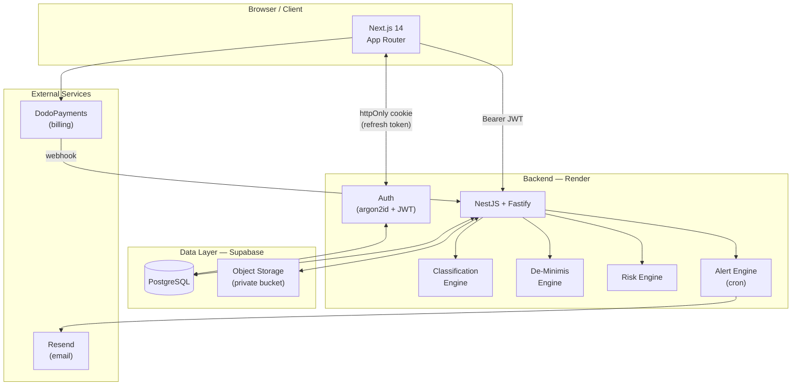
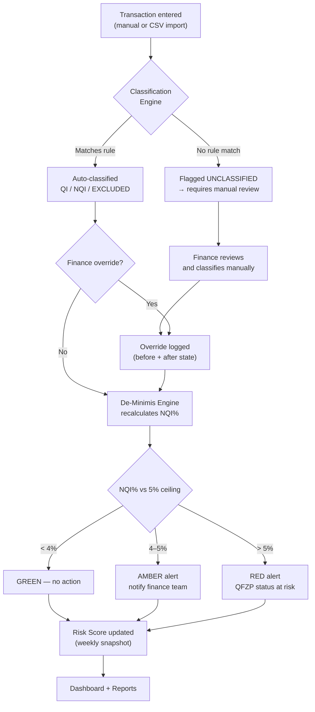

# TaxSentry UAE

**QFZP Status Protection for UAE Free Zone Companies**

If your company operates in a UAE free zone and benefits from the 0% corporate tax rate, you already know the risk: one bad quarter of non-qualifying income can breach the de-minimis threshold and wipe out your QFZP status for the entire year. TaxSentry monitors that threshold in real time, so you find out about a problem in week 3 — not when your auditor does.

---

## The Problem

Under Cabinet Decision 100/2023, a Qualifying Free Zone Person (QFZP) must keep Non-Qualifying Income (NQI) below **5% of total revenue** in any tax period. That sounds simple until you're tracking hundreds of transactions across Zoho, Xero, or manual spreadsheets and trying to know at any given moment whether you're at 3.1% or 5.3%.

Most finance teams find out they've breached after the fact. TaxSentry flips that — every transaction is classified on entry, the threshold is recalculated live, and alerts go out before the breach becomes a tax liability.

---

## What It Does

```
┌─────────────────────────────────────────────────────────────────────────┐
│                         TAXSENTRY PLATFORM                              │
│                                                                         │
│   Revenue In   ──▶   Classification   ──▶   De-Minimis    ──▶  Risk    │
│  (CSV / manual)       (QI / NQI /           Threshold           Score  │
│                        EXCLUDED)            5% Watch            0–100  │
│                            │                    │                  │   │
│                            ▼                    ▼                  ▼   │
│                     Audit Trail           Alerts (INFO/        Reports │
│                     (immutable)           AMBER/RED)           (PDF)   │
└─────────────────────────────────────────────────────────────────────────┘
```

### Core features

- **De-minimis monitor** — live NQI% against the 5% ceiling, per tax period
- **Revenue classifier** — auto-classifies transactions using 19 activity codes from Cabinet Decision 100/2023; lets finance override with a full audit trail
- **Risk score** — weekly snapshots across five factors (de-minimis exposure, substance docs, classification confidence, related-party concentration, audit readiness)
- **Substance vault** — encrypted document storage for trade licenses, lease agreements, payroll registers, board minutes — everything an FTA audit expects
- **Alert engine** — triggers at configurable thresholds; email notifications via Resend; snooze or acknowledge from the dashboard
- **Compliance report** — PDF export with QI/NQI breakdown, risk score, and substance checklist, formatted for auditor handoff
- **Immutable audit log** — every action (who, what, before, after) is recorded and locked; AUDITOR role gets read-only access

---

## System Architecture



---

## Auth Architecture

TaxSentry uses a fully custom, zero-dependency authentication system — no Clerk, no Auth0.

| Token | Type | TTL | Storage |
|---|---|---|---|
| Access token | Signed JWT | 15 minutes | In-memory (Zustand) |
| Refresh token | Opaque (64 bytes) | 30 days | httpOnly cookie, SHA-256 hashed in DB |

**Flow:**
1. `POST /auth/signup` — argon2id password hash, creates org + OWNER user, 14-day trial
2. `POST /auth/login` — verifies password, issues JWT + sets httpOnly `refreshToken` cookie
3. Every platform page load — `AuthProvider` calls `POST /auth/refresh`, rotates token, updates Zustand store
4. API calls — axios interceptor injects `Authorization: Bearer <token>`; silent refresh on 401
5. `POST /auth/logout` — revokes session in DB, clears cookie

**Security:**
- Account lockout after 5 failed attempts (15-minute cooldown)
- Refresh token rotation — each use issues a new token and revokes the old one
- Password reset via time-limited (1h) signed email link
- httpOnly + Secure + SameSite=Lax cookies

---

## Compliance Flow

How a revenue transaction turns into a compliance signal:



---

## Tech Stack

| Layer | Technology |
|---|---|
| Frontend | Next.js 14 (App Router), React 18, Tailwind CSS |
| State / data fetching | Zustand, TanStack Query v5 |
| Forms | React Hook Form + Zod |
| Auth | Custom — argon2id passwords, JWT (15m), httpOnly refresh cookies (30d) |
| Backend | NestJS 10, Fastify adapter |
| Database | PostgreSQL (Supabase), Prisma ORM |
| File storage | Supabase Object Storage (private, signed URLs) |
| Email | Resend (password reset, alerts) |
| Billing | DodoPayments (Merchant of Record) |
| Deployment | Vercel (frontend), Render (API, Docker) |
| CI | GitHub Actions (test, lint, secret scan, Docker build) |

Financial amounts use `Decimal(15,2)` throughout — no floating-point rounding in AED calculations.

---

## Getting Started

### Prerequisites

- Node.js >= 20
- npm >= 10
- A [Supabase](https://supabase.com) project (free tier works)
- A [Resend](https://resend.com) API key (free tier: 3,000 emails/month)

### Install

```bash
git clone https://github.com/ashucfx/tax-sentry-uae.git
cd tax-sentry-uae
npm install
```

### Environment setup

```bash
cp .env.example .env.local
# Fill in: DATABASE_URL, DATABASE_URL_UNPOOLED, SUPABASE_*, RESEND_API_KEY, JWT_SECRET, WEB_URL
```

The `.env.example` file documents every variable with inline comments.  
Generate a secure `JWT_SECRET` with:

```bash
openssl rand -hex 32
```

### Database

```bash
cd apps/api

# Run migrations (uses DATABASE_URL_UNPOOLED — direct session mode)
npx prisma migrate dev --name init

# Seed the 19 activity codes from Cabinet Decision 100/2023
npm run db:seed
```

### Run locally

```bash
# From the repo root — starts both API (:3001) and web (:3000) concurrently
npm run dev
```

- Frontend: http://localhost:3000  
- API: http://localhost:3001/api/v1  
- Swagger docs: http://localhost:3001/api/docs (development only)

---

## Project Structure

```
tax-sentry-uae/
├── apps/
│   ├── api/                    # NestJS backend
│   │   ├── src/
│   │   │   ├── modules/
│   │   │   │   ├── auth/       # Custom JWT auth (signup, login, refresh, reset)
│   │   │   │   │   └── dto/    # Request validation DTOs
│   │   │   │   ├── revenue/    # Transaction CRUD + classification overrides
│   │   │   │   ├── classification/  # Rules engine (Cabinet Decision 100/2023)
│   │   │   │   ├── deminimis/  # 5% NQI threshold calculation
│   │   │   │   ├── risk/       # Multi-factor risk scoring
│   │   │   │   ├── alerts/     # Trigger, notify, snooze
│   │   │   │   ├── substance/  # Document vault (Supabase Storage)
│   │   │   │   ├── reports/    # PDF + CSV export
│   │   │   │   ├── billing/    # DodoPayments webhooks
│   │   │   │   └── audit/      # Immutable action log
│   │   │   └── common/         # Guards (JWT, RBAC, Subscription), interceptors, decorators
│   │   └── prisma/
│   │       ├── schema.prisma   # Data model (User, Session, Org, TaxPeriod, ...)
│   │       └── seed.ts         # Activity catalog seed
│   │
│   └── web/                    # Next.js frontend
│       └── src/
│           ├── app/
│           │   ├── (marketing)/  # Landing, pricing, sign-in, sign-up, forgot/reset password
│           │   └── (platform)/   # Dashboard, transactions, alerts,
│           │                     # reports, billing, settings, audit log
│           ├── components/
│           │   └── layout/      # AuthProvider, Sidebar, TopRibbon
│           └── lib/
│               ├── auth/        # Zustand store + auth actions (login, refresh, logout)
│               └── api/         # Axios client (token injection, silent refresh)
│
└── packages/
    └── shared/                  # Shared types (monorepo)
```

---

## Supported Free Zones

DMCC · JAFZA · IFZA · DIFC · ADGM · RAKEZ · DWC · SHAMS · MEYDAN

---

## Roles & Access

| Role | Access |
|---|---|
| OWNER | Full access, billing, user management |
| FINANCE | Read/write transactions, classification overrides |
| VIEWER | Read-only dashboard |
| AUDITOR | Audit log + read-only compliance data |

---

## Useful Commands

```bash
# API
cd apps/api

npm run db:migrate          # Apply pending migrations (production)
npm run db:migrate:dev      # Apply + generate migration (development)
npm run db:seed             # Seed activity catalog
npm run db:studio           # Prisma Studio GUI

# Tests
npm run test:unit           # Unit tests
npm run test:integration    # Integration tests (needs running DB)
npm run test:cov            # Coverage report

# Build
npm run build               # Compile TypeScript
npm run lint                # ESLint
```

---

## Deployment

| Service | Provider | Notes |
|---|---|---|
| Frontend | Vercel | Auto-deploy from main branch |
| API | Render (Docker) | `apps/api/Dockerfile`, context = repo root |
| Database | Supabase | Free up to 500 MB |
| Email | Resend | Free up to 3k/month |
| Billing | DodoPayments | AED prices, USD charges (fixed peg 3.6725) |

Health check endpoint: `GET /api/v1/health`

Set `NEXT_PUBLIC_API_URL` on Vercel to point to your Render API URL.  
Set `WEB_URL` on Render to your Vercel frontend URL (used in password reset emails).

---

## License

MIT
